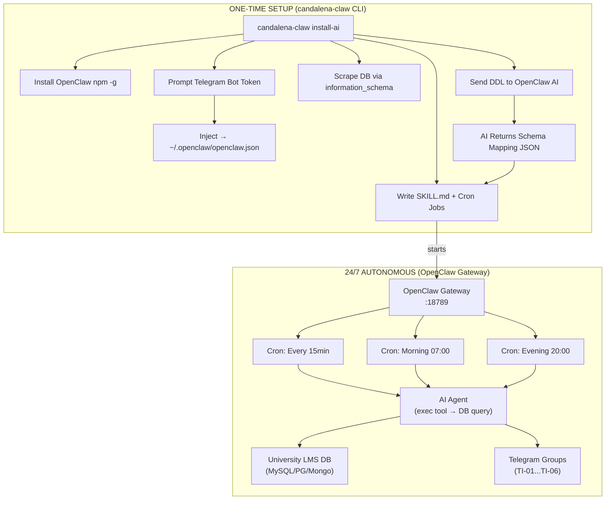
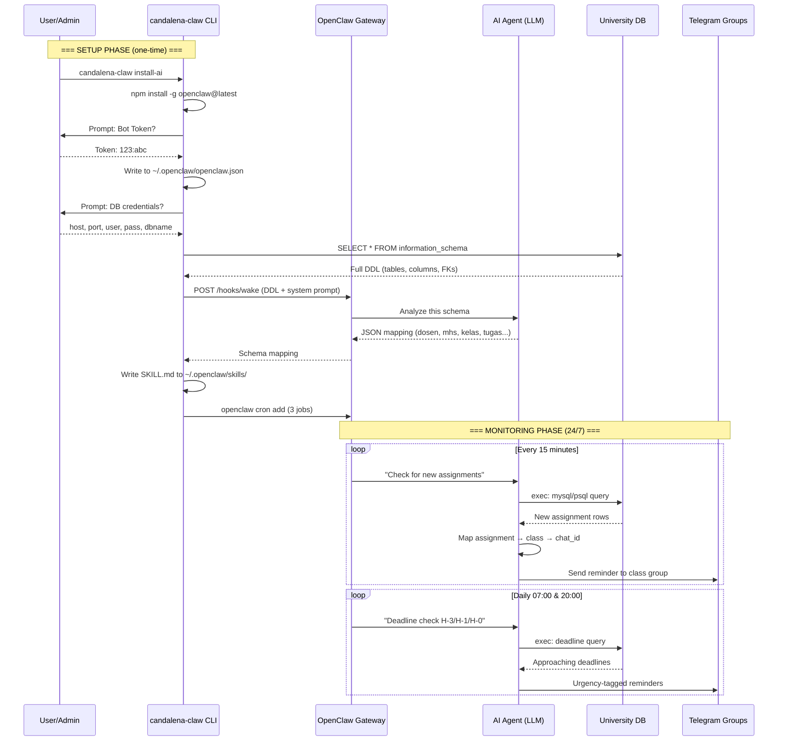

# 🦞 Candalena Claw v3.0

> **AI-Powered LMS Reminder Engine** — CLI Installer & Bridge Tool for OpenClaw AI Gateway

[](https://github.com/candalena-claw)
[](https://nodejs.org)
[](LICENSE)

---

## 📋 Table of Contents

- [What Changed in v3.0](#-what-changed-in-v30)
- [Architecture](#-architecture)
- [How It Works](#-how-it-works)
- [Installation](#-installation)
- [Setup Guide](#-setup-guide-study-case-universitas-a)
- [CLI Commands](#-cli-commands)
- [OpenClaw Skill & Cron](#-openclaw-skill--cron-jobs)
- [Database Monitoring Strategy](#-database-monitoring-strategy)
- [Configuration Reference](#-configuration-reference)
- [Project Structure](#-project-structure)
- [Troubleshooting](#-troubleshooting)

---

## 🔄 What Changed in v3.0

| Aspect | v2.x (Legacy) | v3.0 (AI-Powered) |
|--------|---------------|-------------------|
| **Architecture** | Node.js background script with `node-cron` | CLI Installer + OpenClaw AI Gateway |
| **Database Reading** | Hardcoded schema / manual column detection | AI-powered dynamic DDL analysis |
| **24/7 Worker** | Node.js process (always running) | OpenClaw Gateway daemon |
| **Schema Mapping** | Static `ENV` + hint matching | AI analyzes `information_schema` |
| **Telegram Routing** | Single channel from `.env` | Multi-group routing per class |
| **Intelligence** | None — rule-based | Full LLM reasoning via OpenClaw |
| **Role of CLI** | The entire engine | Installer / Setup Wizard / Bridge |

### Key Architectural Shift

**Before (v2.x):** `candalena-claw` WAS the 24/7 engine — a Node.js script running `node-cron`.

**After (v3.0):** `candalena-claw` is a **CLI Installer / Bridge Tool** that:
1. Installs OpenClaw AI Gateway
2. Scrapes your LMS database schema
3. Feeds the DDL to OpenClaw AI for analysis
4. Deploys a SKILL.md + cron jobs
5. **Hands over 24/7 monitoring to OpenClaw**

---

## 🏗 Architecture



### Data Flow Diagram



---

## 🚀 How It Works

### Phase 1: CLI Setup (One-Time)

```bash
candalena-claw install-ai
```

This command runs a 5-step wizard:

| Step | Action | Details |
|------|--------|---------|
| 1️⃣ | **Install OpenClaw** | `npm install -g openclaw@latest` + `openclaw onboard` |
| 2️⃣ | **Telegram Config** | Injects bot token → `~/.openclaw/openclaw.json` |
| 3️⃣ | **Schema Scrape** | Queries `information_schema` for full DDL |
| 4️⃣ | **AI Analysis** | Sends DDL to OpenClaw AI → gets table mapping |
| 5️⃣ | **Cron Setup** | Creates 3 cron jobs for 24/7 monitoring |

### Phase 2: OpenClaw Takes Over (24/7)

After setup, OpenClaw runs autonomously:

- **Every 15 min**: Checks for new assignments
- **07:00 daily**: Morning deadline reminders (H-3, H-1, H-0)
- **20:00 daily**: Evening urgent deadline reminders
- **Auto-routing**: Matches assignments → classes → Telegram groups

---

## 📦 Installation

### Prerequisites
- **Node.js** 22.14+ 
- **npm** (comes with Node.js)
- A running LMS database (MySQL / PostgreSQL / MongoDB)
- A Telegram Bot token (from [@BotFather](https://t.me/BotFather))

### Install CLI

```bash
# Install globally
npm install -g candalena-claw

# Or clone and build
git clone https://github.com/HudzaifahArrantisi/Candalena-Claww.git
cd candalena-claw
npm install
npm run build
npm link
```

### Quick Start

```bash
# 1. Initialize project (optional — for local .env config)
candalena-claw init

# 2. Run the AI-powered setup wizard
candalena-claw install-ai

# 3. Check status
candalena-claw ai-status

# 4. Monitor OpenClaw logs
openclaw logs --follow
```

---

## 📖 Setup Guide (Study Case: Universitas A)

### Scenario
- Universitas A has: Fakultas → Prodi → Kelas (TI 01-06) → Mahasiswa
- Dosen creates Tugas for Mata Kuliah in specific Kelas
- Each Kelas has a Telegram Group

### Step-by-Step

#### 1. Create Telegram Bot
```
Open Telegram → @BotFather → /newbot → copy token
```

#### 2. Create Telegram Groups for Each Class
```
TI-01 Group → add bot → get Chat ID via @getidsbot
TI-02 Group → add bot → get Chat ID
...
TI-06 Group → add bot → get Chat ID
```

#### 3. Run AI Setup
```bash
candalena-claw install-ai
```

The wizard will:
- Ask for your bot token
- Ask for class-to-group mappings (TI-01 → -100123456789)
- Ask for database credentials
- Scrape all tables from your DB
- Send the DDL to AI for analysis
- AI detects: which table = dosen, mahasiswa, kelas, tugas
- Creates monitoring cron jobs

#### 4. Verify
```bash
# Check everything is configured
candalena-claw ai-status

# Check cron jobs
openclaw cron list

# Watch the AI work
openclaw logs --follow
```

---

## 💻 CLI Commands

| Command | Description |
|---------|-------------|
| `candalena-claw init` | Initialize project folder |
| `candalena-claw setup` | Classic interactive setup (legacy .env mode) |
| `candalena-claw install-ai` | **NEW** — Full OpenClaw AI setup wizard |
| `candalena-claw ai-status` | **NEW** — Show OpenClaw integration status |
| `candalena-claw start` | Start legacy engine (node-cron mode) |
| `candalena-claw stop` | Stop running engine |
| `candalena-claw status` | Show system status |
| `candalena-claw doctor` | Diagnose problems |
| `candalena-claw config` | Show current configuration |
| `candalena-claw test` | Send test reminder |
| `candalena-claw logs` | View realtime logs |
| `candalena-claw reset` | Reset installation |
| `candalena-claw update` | Update to latest version |
| `candalena-claw uninstall` | Completely remove |

---

## 🤖 OpenClaw Skill & Cron Jobs

### Skill File (`~/.openclaw/skills/candalena-lms/SKILL.md`)

The CLI generates a SKILL.md that teaches the AI agent:
- Database connection details
- Class → Telegram group mapping
- AI-detected schema mapping (tables & joins)
- How to query for new assignments
- Reminder message format (Bahasa Indonesia)
- Deduplication rules

### Cron Jobs Created

| Name | Schedule | Purpose |
|------|----------|---------|
| Candalena Morning Check | `0 7 * * *` | H-3, H-1, H-0 reminders |
| Candalena Evening Check | `0 20 * * *` | Urgent final reminders |
| Candalena New Task Check | `*/15 * * * *` | Detect newly posted assignments |

---

## 📊 Database Monitoring Strategy

### Why OpenClaw Cron > Node.js Cron?

| Feature | Node.js `node-cron` | OpenClaw Cron |
|---------|---------------------|---------------|
| Crash recovery | Manual PM2/systemd | Built-in daemon |
| Intelligence | None — static queries | LLM reasoning |
| Schema changes | Breaks | AI adapts |
| Multi-channel | Hardcoded | Dynamic routing |
| Monitoring | DIY logging | `openclaw logs` |

### Polling Strategy

```
┌─────────────────────────────────────────────────┐
│           MONITORING TIMELINE (daily)            │
│                                                  │
│  00:00 ─────────────────────────────── 24:00    │
│    │                                     │       │
│    │  */15m: New task detection           │       │
│    │  ████████████████████████████████   │       │
│    │                                     │       │
│    │  07:00: Morning deadline check      │       │
│    │  ▲                                  │       │
│    │                                     │       │
│    │  20:00: Evening urgent check        │       │
│    │                          ▲          │       │
│    │                                     │       │
│    │  Notification tiers:                │       │
│    │  H-3: 📘 "Reminder: 3 hari lagi"   │       │
│    │  H-1: ⚠️ "Urgent: besok deadline"   │       │
│    │  H-0: 🔴 "HARI INI deadline!"      │       │
└─────────────────────────────────────────────────┘
```

### How AI Queries the Database

OpenClaw uses the `exec` tool to run database commands:

```bash
# MySQL
mysql -h localhost -P 3306 -u root -p'pass' university_db -e "
  SELECT t.*, mk.nama_mk, d.nama_dosen, k.nama_kelas
  FROM tugas t
  JOIN mata_kuliah mk ON t.id_mk = mk.id
  JOIN dosen d ON mk.id_dosen = d.id
  JOIN kelas k ON t.id_kelas = k.id
  WHERE t.notified = 0
  AND t.deadline BETWEEN NOW() AND DATE_ADD(NOW(), INTERVAL 3 DAY)
"
```

The exact query is determined by the AI based on the schema mapping.

---

## ⚙️ Configuration Reference

### `~/.openclaw/openclaw.json` (injected by CLI)

```jsonc
{
  "channels": {
    "telegram": {
      "enabled": true,
      "botToken": "123456:ABC...",
      "dmPolicy": "open",
      "allowFrom": ["*"],
      "groups": {
        "-1001234567890": {
          "requireMention": false,
          "groupPolicy": "open",
          "_candalenaClass": "TI-01"
        },
        "*": { "requireMention": false, "groupPolicy": "open" }
      }
    }
  },
  "tools": {
    "profile": "full",
    "exec": {
      "autoApprove": ["mysql *", "psql *", "mongosh *", "node *", "curl *"]
    }
  },
  "hooks": {
    "enabled": true,
    "token": "candalena-xxx",
    "path": "/hooks"
  }
}
```

### `.candalena/` (local project dir)

```
.candalena/
├── .installed          # First-run marker
├── schema-ddl.sql      # Raw DDL from database
└── schema-mapping.json # AI-analyzed table mapping
```

---

## 📁 Project Structure

```
candalena-claw/
├── src/
│   ├── cli/
│   │   ├── index.ts              # CLI entry point
│   │   ├── setup.ts              # Legacy setup wizard
│   │   ├── ui.ts                 # CLI UI utilities (colors, spinners)
│   │   └── commands/
│   │       ├── install-ai.ts     # ★ NEW: OpenClaw AI setup wizard
│   │       ├── ai-status.ts      # ★ NEW: AI integration status
│   │       ├── init.ts           # Initialize project
│   │       ├── setup.ts          # Legacy .env setup
│   │       ├── start.ts          # Start legacy engine
│   │       ├── doctor.ts         # Diagnostics
│   │       └── ...
│   ├── openclaw/                 # ★ NEW: OpenClaw integration module
│   │   ├── index.ts              # Barrel export
│   │   ├── types.ts              # TypeScript interfaces
│   │   ├── installer.ts          # OpenClaw install & config injection
│   │   ├── schema-scraper.ts     # Multi-DB schema extractor
│   │   ├── ai-prompt.ts          # System prompt & SKILL.md builder
│   │   ├── ai-bridge.ts          # OpenClaw API communication
│   │   └── cron-setup.ts         # Cron job creation
│   ├── adapters/                 # Legacy DB adapters
│   ├── core/                     # Legacy engine core
│   ├── config/                   # Legacy env config
│   └── telegram/                 # Legacy Telegram module
├── package.json
├── tsconfig.json
└── README.md
```

---

## 🔧 Troubleshooting

### OpenClaw Gateway won't start
```bash
# Check if port is in use
lsof -i :18789
# or on Windows
netstat -ano | findstr :18789

# Start manually
openclaw gateway
```

### AI can't analyze schema
```bash
# Ensure gateway is running
openclaw gateway

# Check logs
openclaw logs --follow

# Manually trigger analysis
openclaw cron list
```

### Telegram messages not sending
```bash
# Verify bot token
curl "https://api.telegram.org/bot<TOKEN>/getMe"

# Check group access
curl "https://api.telegram.org/bot<TOKEN>/getUpdates"

# Verify config
cat ~/.openclaw/openclaw.json
```

### Database connection fails
```bash
# Test manually
mysql -h localhost -u root -p your_database
# or
psql -h localhost -U postgres your_database

# Re-run setup
candalena-claw install-ai
```

---

## 📜 Changelog

### v3.0.0 — Major Architectural Rewrite
- **BREAKING**: CLI role changed from engine to installer/bridge
- **NEW**: `install-ai` command — full OpenClaw AI setup wizard
- **NEW**: `ai-status` command — integration health dashboard
- **NEW**: `src/openclaw/` module — OpenClaw integration layer
  - `installer.ts` — automated OpenClaw install + config injection
  - `schema-scraper.ts` — multi-DB DDL extraction via `information_schema`
  - `ai-prompt.ts` — system prompt engineering + SKILL.md builder
  - `ai-bridge.ts` — OpenClaw local API communication
  - `cron-setup.ts` — automated cron job creation
- **NEW**: AI-powered schema analysis (replaces static hint matching)
- **NEW**: Multi-group Telegram routing (per-class groups)
- **NEW**: 3-tier cron job monitoring (morning/evening/realtime)
- Legacy engine (`start` command) still works for non-AI mode

### v2.1.1
- Professional CLI with branded UI
- Multi-database support (MySQL/PostgreSQL/MongoDB)
- Auto-detect schema with column hints
- Uninstall command

---

## 📄 License

ISC © Candalena Claw Contributors
